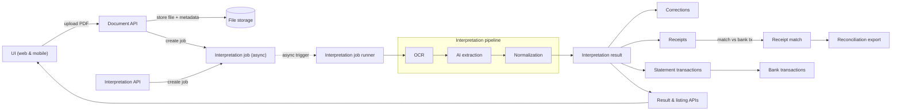
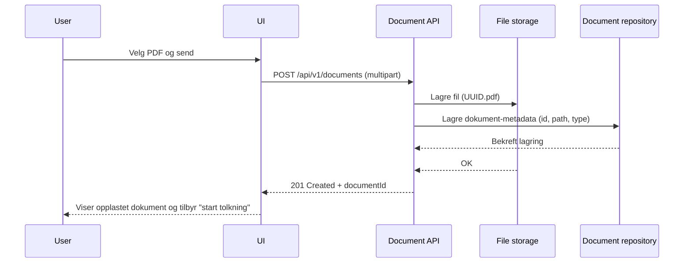
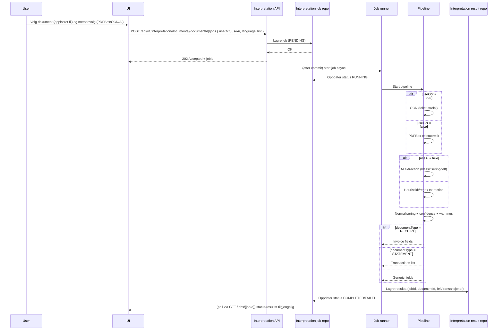

# PocketAccount Architecture & Conventions

Base package: java.com.frnholding.pocketaccount

This backend has three primary features:

1) document       : upload/store PDFs and document metadata (Invoice/Statement)
2) interpretation : async jobs producing structured JSON results + user corrections
3) accounting     : bank transactions, receipts, matching, reconciliation exports

## 1) Feature-first packages (REQUIRED)

java.com.frnholding.pocketaccount
  common/
    config/
    error/
    util/

  document/
    controller/
    api/dto/
    service/
    domain/
    repository/
    repository/entity/
    infra/

  interpretation/
    controller/
    api/dto/
    service/
    domain/
    repository/
    repository/entity/
    pipeline/
    infra/
    mapper/ (optional)

  accounting/
    controller/
    api/dto/
    service/
    domain/
    repository/
    repository/entity/

### Non-negotiable rules
- DTOs live only in api/dto
- Entities live only in repository/entity
- Controllers call services only (never repositories)

## 2) Layer responsibilities

Controller:
- HTTP only (validation, mapping to DTO)
- calls service
- returns DTOs

Service:
- Use cases & orchestration
- owns transactions (@Transactional)
- calls repositories and infra clients

Domain:
- business concepts and invariants
- avoid Spring/JPA dependencies where possible

Repository:
- data access only (JPA repositories, projections, queries)

Infra:
- PDF storage, PDF parsing, OCR, OpenAI calls

## 3) Data types
- IDs: UUID
- Dates: LocalDate
- Timestamps: OffsetDateTime
- Money: BigDecimal
- Never use double/float for monetary values

## 4) API conventions

Base path: /api/v1

Document & interpretation endpoints:
- POST /documents                           (upload PDF)
- POST /documents/{id}/jobs                 (start interpretation job)
- GET  /jobs/{jobId}                        (job status)
- GET  /documents/{id}/result               (latest interpreted JSON result)
- PUT  /documents/{id}/correction           (save corrected JSON)

Accounting endpoints:
- POST /accounts
- GET  /accounts
- POST /bank-transactions/import
- GET  /bank-transactions?accountId=...&from=...&to=...
- POST /receipts
- GET  /receipts?from=...&to=...
- POST /matches
- DELETE /matches/{matchId}
- GET /bank-transactions/{id}/match-status
- GET /reconciliation?accountId=...&from=...&to=...
- GET /reconciliation/export?accountId=...&from=...&to=...&format=csv

## 5) Idempotency, matching and reconciliation

Bank import MUST be idempotent:
- unique(account_id, source_line_hash)

Matching supports partial matching:
- receipt_match.matched_amount

Match status is derived:
- abs(bank_transaction.amount) compared to sum(receipt_match.matched_amount)

## 6) Error handling

Standard error response:
ApiErrorResponse { code, message, details }

Use @ControllerAdvice and map:
- validation -> 400
- not found -> 404
- unique/conflict -> 409

## 7) System overview (Mermaid)



## 8) Use case: Upload file (sequence)



## 9) Use case: Interpret document (sequence)



## 10) Use case: Corrections (sequence)

```mermaid
sequenceDiagram
  participant User
  participant UI
  participant IntAPI as Interpretation API
  participant ResultRepo as Interpretation result repo
  participant CorrHist as Correction history

  User->>UI: Åpne tolkingsresultat (viser original)
  UI->>IntAPI: GET /api/v1/interpretation/documents/{id}/result
  IntAPI-->>UI: Returnerer latest result (original tolking)
  User->>UI: Rediger felt/transaksjoner (korrigert versjon)
  UI->>IntAPI: PUT /api/v1/interpretation/documents/{id}/correction { correctedFields/transactions }
  IntAPI->>ResultRepo: Lagre korrigert versjon (samme documentId, ny versjon)
  IntAPI->>CorrHist: Append snapshot (before/after) for audit
  ResultRepo-->>IntAPI: OK (corrected stored)
  CorrHist-->>IntAPI: OK
  IntAPI-->>UI: 200 OK
  UI-->>User: Viser korrigert visning; original er fortsatt bevart i historikk
```
